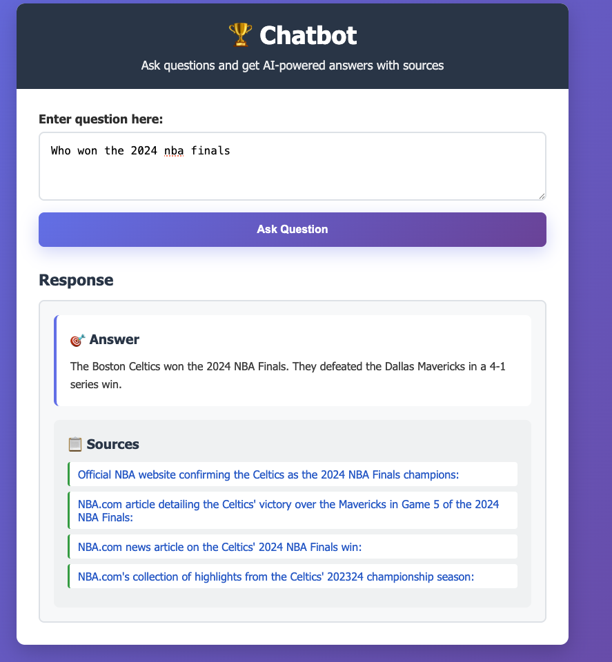

# What is this?

This is a chatbot which is a wrapper to OpenAI and SerpAPI.  This provides answers **and sources**.


SerpAPI is a google search API.  OpenAI is a chatGPT API. They are used together so that the web is used when fetching information.


## getting started

in one terminal: `npm run dev`  -> starts the service

in another terminal: `open public/index.html`  -> run the FE

## Features

- **AI-Powered Responses**: Uses OpenAI GPT-4 for intelligent sports statistics analysis
- **Google Search Integration**: Uses SerpAPI to access Google search results in real-time
- **TypeScript**: Fully typed for better development experience

## Why SerpAPI?

SerpAPI provides access to Google search results via API, giving you:
- **Comprehensive Coverage**: Google's vast index for sports information
- **Official Sources**: Direct access to ESPN, NBA.com, NFL.com, etc.
- **Real-time Results**: Current sports scores, news, and statistics
- **Reliable Data**: Same results you'd get from google.com

## Quick Setup

### 1. Get Your SerpAPI Key
1. Visit https://serpapi.com/
2. Sign up for a free account (100 searches/month free)
3. Go to your dashboard and copy your API key

### 2. Configure Your Environment
```bash
# Clone and install
cd /Users/rex/work/rexposadas/chatbot
npm install

# Configure .env file
OPENAI_API_KEY=your_openai_api_key
SEARCH_PROVIDER=serpapi
SEARCH_API_KEY=your_serpapi_key_here
```

### 3. Run the Server
```bash
npm run dev
```

## API Usage

### Get Sports Statistics with Google Search
```bash
POST /api/chat
Content-Type: application/json

{
  "question": "Who won the 2024 NBA Finals and what were the final game scores?"
}
```

**Example Response:**
```json
{
  "answer": "The Boston Celtics won the 2024 NBA Finals, defeating the Dallas Mavericks 4 games to 1. The final game scores were: Game 1: Celtics 107-89, Game 2: Mavericks 98-105...",
  "sources": [
    "NBA Finals 2024 Results - https://www.nba.com/finals/2024/results",
    "Celtics Championship Victory - https://www.espn.com/nba/story/2024/finals/results"
  ],
  "searchResults": [...]
}
```

### Test Google Search Directly
```bash
POST /api/search
Content-Type: application/json

{
  "query": "NBA Finals 2024 results Celtics Mavericks"
}
```

### Health Check
```bash
GET /health
```

## How It Works

1. **Question Received** → User asks about sports statistics
2. **Google Search** → SerpAPI searches Google with optimized sports queries
3. **Result Filtering** → Prioritizes official sports websites and recent content
4. **AI Analysis** → OpenAI GPT-4 analyzes Google results + training data
5. **Source Citation** → Returns answer with Google search result URLs
6. **Response** → User gets current info with verifiable sources

## Search Optimization

The system uses intelligent search strategies:

### Primary Search Patterns:
- `{query} site:espn.com OR site:nba.com OR site:nfl.com OR site:mlb.com`
- `{query} official sports statistics 2024 2025`
- `{query} sports news latest`

### Source Prioritization:
1. **Official League Sites**: NBA.com, NFL.com, MLB.com, NHL.com
2. **Major Sports Media**: ESPN.com, CBSSports.com, SI.com
3. **Recent Content**: Results mentioning 2024, 2025, "latest", "current"

## Benefits Over Standard OpenAI

✅ **Current Information**: Access to real-time Google search results  
✅ **Official Sources**: Direct links to ESPN, NBA.com, NFL.com, etc.  
✅ **Reduced Hallucination**: Google search provides factual grounding  
✅ **Verifiable Claims**: All answers include clickable Google result URLs  
✅ **Sports-Optimized**: Filtering prioritizes sports content  

## SerpAPI Pricing

- **Free Tier**: 100 searches/month
- **Starter**: $50/month for 5,000 searches
- **Production**: $150/month for 15,000 searches

*100 free searches is typically enough for testing and light usage*

## Environment Variables

```env
# Required
OPENAI_API_KEY=your_openai_api_key
SEARCH_PROVIDER=serpapi
SEARCH_API_KEY=your_serpapi_key

# Optional (defaults shown)
PORT=3000
```

## Example Questions That Work Well

- "Who won the 2024 NBA Finals?"
- "What are LeBron James' career statistics?"
- "Latest NFL trade news"
- "Premier League standings 2024"
- "Who leads MLB in home runs this season?"
- "NBA MVP award 2024"

## Development

```bash
# Development mode with auto-restart
npm run dev

# Build for production
npm run build

# Start production server
npm start
```

## Error Handling

The API gracefully handles:
- Missing SerpAPI key (falls back to OpenAI training data)
- SerpAPI rate limits (returns partial results)
- Network timeouts (retries with simpler queries)
- Invalid queries (returns helpful error messages)

## Testing Your Setup

1. **Test SerpAPI Connection**:
   ```bash
   curl -X POST http://localhost:3000/api/search \
     -H "Content-Type: application/json" \
     -d '{"query": "NBA Finals 2024"}'
   ```

2. **Test Full Pipeline**:
   ```bash
   curl -X POST http://localhost:3000/api/chat \
     -H "Content-Type: application/json" \
     -d '{"question": "Who won the most recent Super Bowl?"}'
   ```

3. **Check Health**:
   ```bash
   curl http://localhost:3000/health
   ```

## License

MIT
